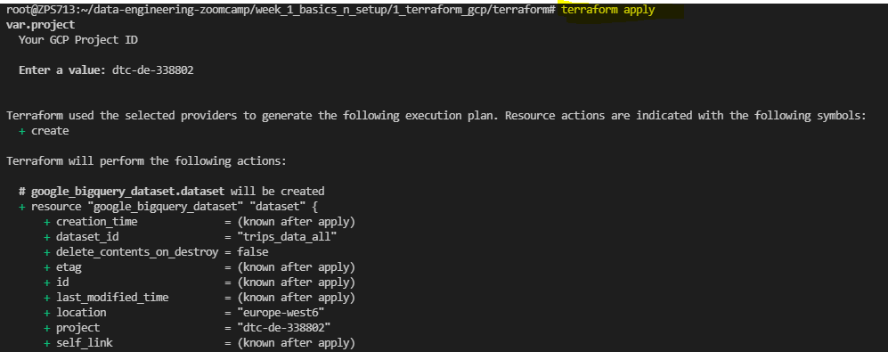
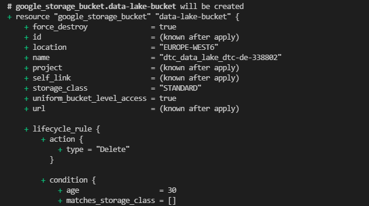
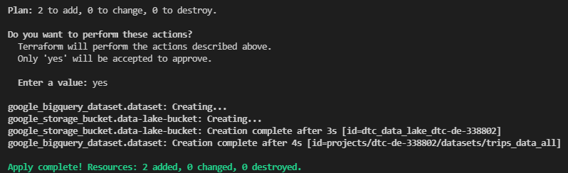

## Week 1 Homework

In this homework we'll prepare the environment 
and practice with terraform and SQL

## Question 1. Google Cloud SDK

Install Google Cloud SDK. What's the version you have? 

To get the version, run `gcloud --version`

### Answer: Google Cloud SDK 369.0.0


## Google Cloud account 

Create an account in Google Cloud and create a project.

## Question 2. Terraform 

Now install terraform and go to the terraform directory (`week_1_basics_n_setup/1_terraform_gcp/terraform`)

After that, run

* `terraform init`
* `terraform plan`
* `terraform apply` 

Apply the plan and copy the output (after running `apply`) to the form.
It should be the entire output - from the moment you typed `terraform init` to the very end.

### Answer:






## Prepare Postgres 

Run Postgres and load data as shown in the videos

We'll use the yellow taxi trips from January 2021:

```bash
wget https://s3.amazonaws.com/nyc-tlc/trip+data/yellow_tripdata_2021-01.csv
```

You will also need the dataset with zones:

```bash 
wget https://s3.amazonaws.com/nyc-tlc/misc/taxi+_zone_lookup.csv
```

Download this data and put it to Postgres

## Question 3. Count records 

How many taxi trips were there on January 15?

Consider only trips that started on January 15.

### Answer: 53024
### SQL:

~~~~sql
SELECT COUNT(index) from public.yellow_taxi_trips 
WHERE DATE(tpep_pickup_datetime) = '2021-01-15';
~~~~

## Question 4. Largest tip for each day

Find the largest tip for each day. 
On which day it was the largest tip in January?

Use the pick up time for your calculations.

(note: it's not a typo, it's "tip", not "trip")

### Answer: 2021-01-20
### SQL:

~~~~sql
SELECT DATE(tpep_pickup_datetime)
FROM public.yellow_taxi_trips
WHERE tip_amount =
(SELECT MAX(tip_amount) 
from public.yellow_taxi_trips
WHERE to_char(tpep_pickup_datetime, 'YYYY-MM')= '2021-01');
~~~~

## Question 5. Most popular destination

What was the most popular destination for passengers picked up 
in central park on January 14?

Use the pick up time for your calculations.

Enter the zone name (not id). If the zone name is unknown (missing), write "Unknown" 

### Answer: Upper East Side South
### SQL:

~~~~sql
CREATE TEMP TABLE taxi_passenger_count_sum AS
(SELECT "PULocationID", "DOLocationID", SUM("passenger_count") as "passenger_count_sum"
FROM "public"."yellow_taxi_trips"
WHERE "PULocationID" = 43
AND DATE(tpep_pickup_datetime) = '2021-01-14'
GROUP BY "PULocationID", "DOLocationID");

SELECT "DOLocationID","passenger_count_sum" FROM taxi_passenger_count_sum
WHERE "passenger_count_sum" =
(SELECT MAX("passenger_count_sum") FROM taxi_passenger_count_sum;
~~~~

## Question 6. Most expensive locations

What's the pickup-dropoff pair with the largest 
average price for a ride (calculated based on `total_amount`)?

Enter two zone names separated by a slash

For example:

"Jamaica Bay / Clinton East"

If any of the zone names are unknown (missing), write "Unknown". For example, "Unknown / Clinton East". 

### Answer: Alphabet City/Unknown
### SQL:

~~~~sql
CREATE TEMP TABLE taxi_total_amount_avg AS
(SELECT "PULocationID", "DOLocationID", AVG("total_amount") as "total_amount_avg"
FROM "public"."yellow_taxi_trips"
GROUP BY "PULocationID", "DOLocationID");

SELECT "PULocationID", "DOLocationID" FROM taxi_total_amount_avg
WHERE total_amount_avg =
(SELECT MAX(total_amount_avg) from taxi_total_amount_avg);
~~~~

## Submitting the solutions

* Form for submitting: https://forms.gle/yGQrkgRdVbiFs8Vd7
* You can submit your homework multiple times. In this case, only the last submission will be used. 

Deadline: 24 January, 17:00 CET

